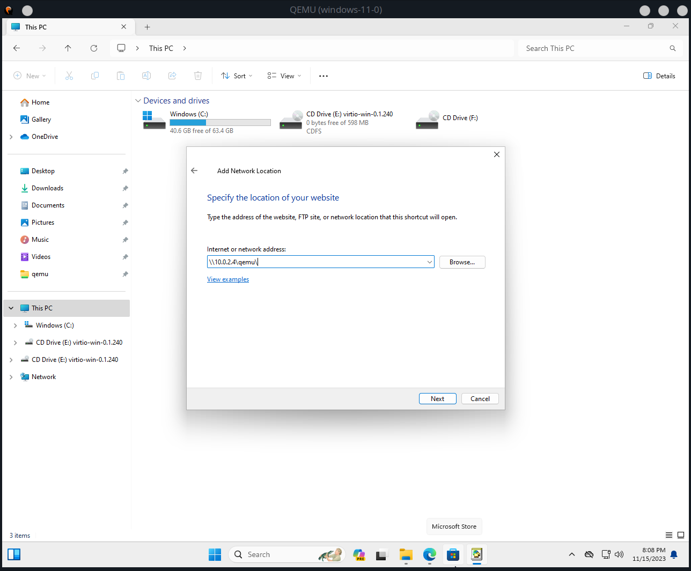

# autotax

- [Installation](#installation)
- [License](#license)

## Installation

[Download the latest release here](https://github.com/photomath/autotax/releases/download/v0.0.3/autotax-0.0.3-py3-none-any.whl)

```console
(~/Public/porezi)$ python3 -m venv autotax
(~/Public/porezi)$ ./autotax/bin/activate
(~/Public/porezi)$ (autotax) pip install autotax-0.0.3-py3-none-any.whl
```

## Usage

```console
$ autotax --help
Usage: autotax [OPTIONS]

Options:
  --first-name TEXT               [required]
  --last-name TEXT                [required]
  --oib TEXT                      [required]
  --date [%Y-%m-%d|%Y-%m-%dT%H:%M:%S|%Y-%m-%d %H:%M:%S]
                                  [required]
  --town TEXT                     [required]
  --street-name TEXT              [required]
  --street-number INTEGER         [required]
  --email-address TEXT            [required]
  --gsu-price-raw TEXT            [required]
  --gsu-amount INTEGER            [required]
  --install-completion [bash|zsh|fish|powershell|pwsh]
                                  Install completion for the specified shell.
  --show-completion [bash|zsh|fish|powershell|pwsh]
                                  Show completion for the specified shell, to
                                  copy it or customize the installation.
  --help                          Show this message and exit.
```

# Advanced: QEMU for doing the taxes

Due to the bizarre constraints by Porezna Uprava RH, it's only possible to upload the generated `.xml` in Windows. This tutorial shows you how to use QEMU for virtualizing windows for tax purposes.

<details>
<summary>Linux</summary>

### 0. Prerequisites

```console
$ # Make a directory in the Public directory (important)
$ mkdir ~/Public/porezi && pushd ~/Public/porezi
$
$ # Install the Samba file sharing protocol
$ pacman -Syu samba
```

### 1. Install `quickemu`

[Instructions here](https://github.com/quickemu-project/quickemu#install-quickemu)

```console
$ yay -Sy quickemu
```

### 2. Download Windows ISO

```console
$ quickget windows 11  # or some other supported Windows version
```

**NOTE: This will populate your working directory. Be careful where you run this command. It's best to be inside `~/Public/porezi` directory.**

### 3. Start the virtual machine and install Windows

To run QEMU, run:

```console
$ quickemu --vm windows-11.conf
```

This command outputs some stuff. Take note of this line, we'll be needing it later:

```
...
 - smbd:     On guest: smb://10.0.2.4/qemu
...
```

Just install Windows like you would on a real computer, by picking the keyboard, accepting the EULA etc.

Your default user will be `Quickemu` and default password `quickemu`.

TODO: image

### 4. Create a portal to your host OS

By `Host OS` I mean your Linux OS. We'll be exposing the `~/Public` directory of your host by exporting it as a network location to Windows.

Open up `Windows explorer`, go to `This PC` and `<Right Click> -> Add a network location`.


Click `Next`
Click `Next` again.

Write the IP address above, _but with slashes substituted with backslashes_, like this:



Press `OK`.

You can now visit your `~/Public/porezi` folder in Windows! If you put your generated XML files here, you can upload them to e-porezna directly.

### 5. Login to e-porezna

Login to `https://e-porezna.porezna-uprava.hr` using your favourite authentication method.


### 6. Install the necessary software

Visit `Dostavi obrazac` and click `JOPPD -> Dostavi datoteku`.


Click the button `Odaberi datoteku`.

The e-porezna setup should then lead you through a procedure of installing the necessary software support. Namely, there are two components, a browser add-on, and a `.msi` you download and install.


### 7. Profit

After the installation, you can continue by uploading the XML and finishing with your tax submission. Whether or not you actually _pay_ is none of my concerns.


</details>

<details>
<summary>Mac OS</summary>
```
TODO but try to follow Linux, it can't be that different.
(famous last words)
```
</details>
